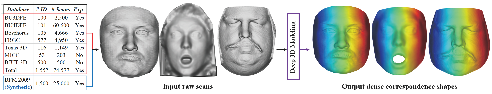

## 3D Face Modeling from Diverse Raw Scan Data

=======

We propose a novel PointNet-based encoder-decoder framework that for the first time jointly learns an expressive face model from a diverse set of raw 3D scans and establishes dense correspondence among them.

=======

3D Face Modeling from Diverse Raw Scan Data 
[Feng Liu](http://www.face3d.org/), [Tran Luan](http://www.cse.msu.edu/~tranluan/), [Xiaoming Liu](http://www.cse.msu.edu/~liuxm/index2.html) 
Department of Computer Science and Engineering, Michigan State University. 
